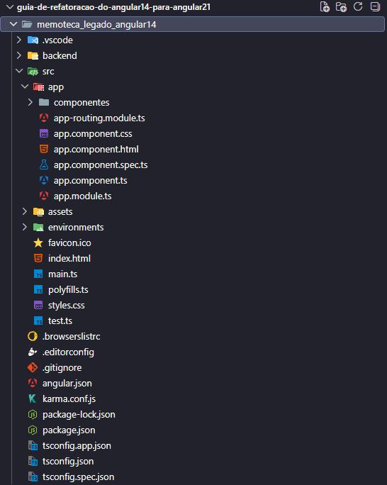
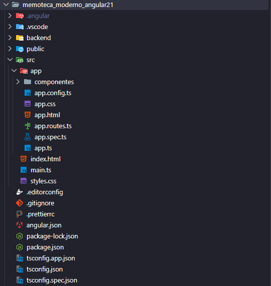
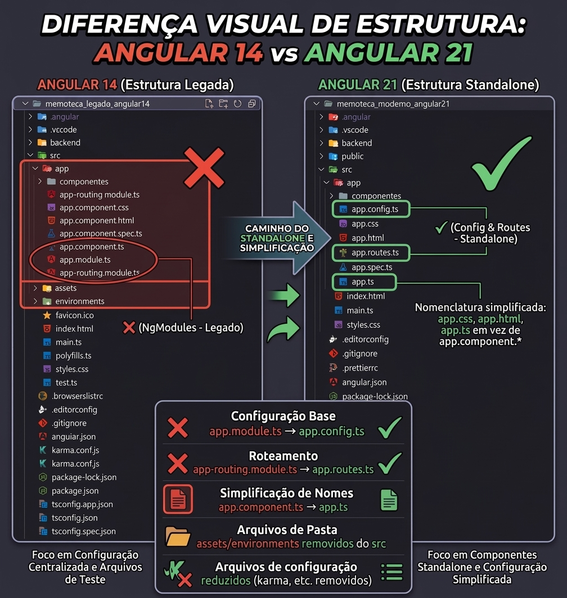

# Estudo Técnico, Refatoração e Migração Arquitetural de Angular 14 para Angular 21.x

## 1. Sobre o projeto

Este repositório apresenta um **estudo técnico e prático de modernização arquitetural de uma aplicação Angular**, documentando a evolução de uma aplicação originalmente desenvolvida com Angular 14 para uma implementação baseada em recursos e padrões introduzidos nas versões mais recentes do framework, com foco no Angular 21.x.

O projeto utiliza uma aplicação CRUD de gerenciamento de dados denominada **"Pensamentos"** como estudo de caso para analisar, implementar e documentar mudanças relacionadas à arquitetura, injeção de dependências, organização de componentes, reatividade, integração com APIs REST e mecanismos de atualização da interface.

Além do código-fonte, o repositório contém documentação das decisões técnicas, problemas identificados durante a migração e soluções implementadas.

---

## 2. Identificação da produção

| Item                     | Informação                                           |
| ------------------------ | ---------------------------------------------------- |
| **Autor**                | Guilherme Augusto Silva Camilo                       |
| **Natureza**             | Produção Técnica / Material Técnico-Instrucional     |
| **Área**                 | Desenvolvimento de Software / Engenharia de Software |
| **Tecnologia principal** | Angular / TypeScript                                 |
| **Versão de referência** | Angular 14                                           |
| **Versão modernizada**   | Angular 21.x                                         |
| **Tipo de aplicação**    | Aplicação web CRUD                                   |
| **Arquitetura estudada** | NgModules × Standalone Components                    |
| **Integração**           | API REST / JSON Server                               |
| **Licença**              | MIT                                                  |

---

## 3. Finalidade

O trabalho tem como finalidade **sistematizar conhecimentos técnicos relacionados à evolução arquitetural do framework Angular**, utilizando uma aplicação funcional como estudo de caso.

A produção contempla tanto a implementação prática quanto a documentação das decisões tomadas durante o processo de modernização, permitindo comparar diferentes abordagens arquiteturais e reproduzir os procedimentos realizados.

---

## 4. Origem e contribuição autoral

A aplicação utilizada como ponto de partida foi desenvolvida originalmente a partir de conteúdo didático sobre Angular 14, utilizado como referência para a construção da aplicação CRUD.

A partir dessa base, foi realizada uma atividade independente de **análise, refatoração, modernização e documentação técnica**, incluindo:

* análise da arquitetura existente;
* identificação de padrões relacionados à versão anterior do framework;
* migração para uma arquitetura baseada em Standalone Components;
* atualização da estratégia de injeção de dependências;
* adequação da aplicação às APIs e padrões modernos do Angular;
* investigação de problemas relacionados ao carregamento e atualização de dados;
* tratamento de respostas provenientes da API REST;
* aplicação de técnicas de imutabilidade na atualização do estado;
* análise do mecanismo de Change Detection;
* reorganização da estrutura dos componentes;
* documentação das decisões e soluções adotadas;
* manutenção de uma implementação Angular 14 para fins de comparação.

> **Importante:** o conteúdo didático utilizado como referência constitui a origem da aplicação-base. A análise comparativa, a refatoração, a migração arquitetural, a investigação dos problemas encontrados, as soluções implementadas e a documentação apresentada neste repositório constituem a contribuição técnica deste trabalho.

---

# 5. Objetivos técnicos

O estudo foi desenvolvido com os seguintes objetivos:

1. Comparar padrões arquiteturais utilizados no Angular 14 com abordagens disponíveis nas versões modernas do framework.
2. Migrar componentes baseados em `NgModule` para **Standalone Components**.
3. Modernizar a estratégia de injeção de dependências utilizando `inject()`.
4. Investigar problemas relacionados à atualização assíncrona de dados na interface.
5. Avaliar a interação entre atualização de estado, referências de objetos e Change Detection.
6. Implementar tratamento para diferentes formatos de resposta da API.
7. Separar responsabilidades entre apresentação, estado e serviços.
8. Produzir documentação técnica capaz de permitir a reprodução do estudo.

---

# 6. Estudo comparativo

| Aspecto              | Angular 14                           | Angular 21.x                                             | Objetivo da modernização                                                  |
| -------------------- | ------------------------------------ | -------------------------------------------------------- | ------------------------------------------------------------------------- |
| Arquitetura          | `NgModules`                          | Standalone Components                                    | Reduzir acoplamento estrutural e simplificar a composição dos componentes |
| Dependências         | Declarações/injeção convencional     | `inject()` e imports explícitos                          | Modernizar a composição dos componentes                                   |
| Organização          | Dependências concentradas em módulos | Dependências declaradas no componente                    | Tornar dependências mais explícitas                                       |
| Estado               | Atribuições diretas                  | Atualização com novas referências                        | Tornar a atualização de estado mais previsível                            |
| Detecção de mudanças | Fluxo padrão do Angular              | Uso explícito de `ChangeDetectorRef` no cenário estudado | Controlar uma nova verificação após atualização assíncrona                |
| Formulários          | `FormsModule`                        | `FormsModule` com componentes Standalone                 | Adequação da arquitetura moderna                                          |
| Integração REST      | Serviço HTTP + modelo                | Serviço HTTP + normalização dos dados                    | Maior robustez no tratamento das respostas                                |

---

# 7. Arquitetura do projeto

O repositório mantém duas implementações independentes:

```text
/
├── memoteca_legado_angular14/
│   └── Aplicação original em Angular 14
│
├── memoteca_moderno_angular21/
│   └── Aplicação modernizada em Angular 21.x
│
├── README.md
│
└── LICENSE
```

A separação permite executar e analisar as duas implementações individualmente, facilitando a comparação entre as arquiteturas.

---

# 8. Principais alterações realizadas

## 8.1 Migração para Standalone Components

A arquitetura modernizada elimina a dependência estrutural de `NgModules` para a declaração dos componentes.

As dependências utilizadas pelo componente passam a ser declaradas explicitamente:

```typescript
@Component({
  selector: 'app-editar-pensamento',
  standalone: true,
  imports: [
    CommonModule,
    FormsModule
  ],
  templateUrl: './editar-pensamento.html',
  styleUrls: ['./editar-pensamento.css']
})
```

Essa abordagem torna a composição do componente mais explícita e reduz a necessidade de estruturas intermediárias para organização das dependências.

---

## 8.2 Modernização da injeção de dependências

A aplicação modernizada utiliza a API `inject()`:

```typescript
export class EditarPensamentoComponent implements OnInit {

  private readonly service = inject(PensamentoService);
  private readonly route = inject(ActivatedRoute);
  private readonly router = inject(Router);
  private readonly cdr = inject(ChangeDetectorRef);

}
```

A alteração foi realizada como parte da modernização da implementação e da adaptação aos padrões atuais do Angular.

---

## 8.3 Comparativo Visual de Estrutura de Arquivos

A diferença entre as arquiteturas pode ser observada diretamente na organização da pasta `src/app/` de cada versão:

| Angular 14 (Base Legada) | Angular 21.x (Modernizado) |
| :---: | :---: |
|  |  |
| *Presença de `app.module.ts` e `app-routing.module.ts`* | *Substituição por `app.config.ts` e `app.routes.ts` (100% Standalone)* |

---

### Infográfico de Análise Detalhada

O diagrama a seguir sintetiza e destaca visualmente as principais mudanças na árvore de arquivos:



**Principais evidências observadas na árvore de arquivos:**
1. **Eliminação do `app.module.ts`:** A versão modernizada remove totalmente o módulo raiz em favor do arquivo de configuração `app.config.ts`.
2. **Simplificação do roteamento:** Substituição do módulo de rotas tradicional (`app-routing.module.ts`) pelas rotas funcionais declaradas em `app.routes.ts`.
3. **Nomenclatura enxuta de componentes:** Adoção de nomes simplificados nos arquivos do componente (ex.: `app.ts`, `app.html` e `app.css` em vez de `app.component.*`).
4. **Enxugamento da raiz `src/`:** Remoção de diretórios legados (`assets/` e `environments/` internos) e eliminação de arquivos de configuração e testes antigos (como `karma.conf.js` e `polyfills.ts`).

---

## 8.4 Evolução de Dependências, Tooling e Impacto Arquitetural (package.json)

A modernização do arquivo de manifesto de dependências (`package.json`) evidencia o salto técnico entre o ecossistema do Angular 14 e a arquitetura Angular 21.x, destacando a eliminação de redundâncias, a troca da suíte de testes e o ganho de eficiência no build.

| Categoria | Projeto Legado (Angular 14) | Projeto Modernizado (Angular 21.x) | Impacto Técnico e Justificativa |
| :--- | :--- | :--- | :--- |
| **Framework Base** | `@angular/* ^14.0.0` | `@angular/* ^21.2.0` | Atualização do ecossistema principal habilitando suporte nativo a Standalone Components, APIs funcionais de roteamento (`provideRouter`), injeção com `inject()` e reatividade moderna. |
| **Execução & Polyfills** | `zone.js ~0.11.4`<br>`@angular/animations ^14.0.0` | *Removidos do manifesto* | Desacoplamento de dependências pesadas de animação e preparação da arquitetura para execução *zoneless* nativa. |
| **Suporte REST (Mock)** | N/A | `json-server ^0.17.4` | Inclusão de servidor mock integrado nas dependências do projeto para simulação local precisa de endpoints REST. |
| **Ferramental de Build** | `@angular-devkit/build-angular ^14.0.3` | `@angular/build ^21.2.24` | Substituição do builder legado pela nova API `@angular/build` alimentada por Esbuild/Vite, acelerando drasticamente o tempo de compilação. |
| **Suíte de Testes** | `Karma` + `Jasmine`<br>(5 pacotes `karma-*` e `jasmine-*`) | `Vitest ^4.0.8`<br>`jsdom ^28.0.0` | Eliminação completa do Karma/Jasmine em favor do Vitest + jsdom, permitindo execução de testes unitários instantânea no terminal sem necessidade de subir navegador headless Chrome. |
| **Padronização de Código** | N/A | `prettier ^3.8.1` | Introdução de formatador de código opinativo para garantir consistência estilística entre os arquivos do repositório. |
| **Linguagem & Runtime** | `typescript ~4.7.2`<br>`rxjs ~7.5.0` | `typescript ~5.9.2`<br>`rxjs ~7.8.0` | Upgrade da linguagem para TypeScript 5.x, garantindo tipagem mais rigorosa, suporte às novas features do ECMAScript e otimização no tempo de checagem estática. |
| **Gerenciador de Pacotes** | N/A | `npm@10.8.2` | Fixação da versão do `packageManager` para garantir determinismo e reprodutibilidade do ambiente de instalação via NPM. |

---

### Análise de Mudança de Sintaxe e Boas Práticas de Atualização

#### 1. Ruptura de Sintaxe em Grandes Saltos de Versão
Grandes lacunas entre versões major do Angular não trazem apenas correções de bugs, mas verdadeiras **mudanças de paradigma de código**:
* **Sintaxe de Template:** Substituição de diretivas estruturais antigas (`*ngIf`, `*ngFor`) pelo novo *Control Flow* declarativo e otimizado (`@if`, `@for`, `@switch`).
* **Gerenciamento de Estado e Reatividade:** Transição de observables puramente imperativos para a Reatividade Primitiva via **Signals** (`signal()`, `computed()`, `effect()`).
* **Injeção de Dependência:** Substituição da injeção via construtor legada pelo uso funcional do `inject()`.

#### 2. Importância da Manutenção em Versões Recentes (LTS)
Manter a aplicação em versões ativas e preferencialmente **LTS (Long Term Support)** é uma prática crítica de governança de software que impacta diretamente os pilares operacionais do sistema:
* **Segurança:** Versões defasadas acumulam vulnerabilidades conhecidas (*CVEs*) em dependências transitivas que deixam de receber *patches* de segurança.
* **Desempenho e Mecânica:** Atualizações trazem motores de renderização mais otimizados, menor consumo de memória no navegador do cliente e compilações substancialmente mais rápidas com Esbuild/Vite.
* **Usabilidade e DX (Developer Experience):** Ferramentais modernos e APIs simplificadas reduzem a carga cognitiva da equipe, aceleram o onboarding de novos desenvolvedores e evitam o isolamento tecnológico da aplicação.

#### 3. O Problema Exponencial da Refatoração em Softwares Sem SOLID
A negligência do ciclo de vida de atualização cria um débito técnico que cresce exponencialmente. Quando a aplicação **não segue os princípios SOLID** (especialmente Responsabilidade Única, Acoplamento Forte e Inversão de Dependência):
* O custo de migração deixa de ser uma simples atualização de dependências e transforma-se em uma reescrita dolorosa do projeto (*rewrite*).
* Mudanças em sintaxes depreciadas passam a quebrar partes não relacionadas do código devido ao alto acoplamento dos componentes com módulos legados (`NgModules`).
* A ausência de abstração e isolamento dificulta a criação de testes automatizados, tornando qualquer refatoração um processo propenso a regressões graves em produção.

> **Nota sobre a estratégia adotada:** A fixação dos pacotes na versão `21.2.x` garante que a aplicação permaneça em um patamar estável e moderno, usufruindo das melhores práticas de arquitetura e desempenho da plataforma, mitigando os riscos de obsolescência programada sem comprometer a estabilidade do ambiente operacional.

---

# 9. Tratamento das respostas da API

Durante a integração com o servidor REST utilizado no estudo, foi identificado um cenário no qual uma operação de consulta poderia retornar os dados encapsulados em uma estrutura de array.

Para tornar o componente capaz de trabalhar com os formatos identificados, foi implementada uma etapa de normalização:

```typescript
const dados =
  Array.isArray(resposta)
    ? resposta[0]
    : resposta;
```

Essa etapa separa o formato recebido da API do formato utilizado internamente pelo componente.

A abordagem reduz a dependência do componente em relação ao formato específico da resposta e permite que o objeto utilizado no formulário seja normalizado antes de sua atribuição ao estado.

---

# 10. Atualização do estado e Change Detection

Um dos pontos investigados durante o desenvolvimento foi o comportamento da interface após o carregamento assíncrono dos dados utilizados pelo formulário de edição.

A implementação passou a utilizar uma nova referência do objeto durante a atualização do estado:

```typescript
this.service.buscarPorId(id).subscribe((pensamento) => {

  const dados =
    Array.isArray(pensamento)
      ? pensamento[0]
      : pensamento;

  this.pensamento = { ...dados };

  this.cdr.detectChanges();

});
```

O operador spread produz uma nova referência do objeto atribuído ao estado.

No cenário analisado, a chamada de `detectChanges()` solicita explicitamente uma nova verificação da árvore de componentes após a atualização assíncrona dos dados.

A combinação dessas técnicas foi utilizada para tornar explícita a atualização do estado e assegurar a sincronização da interface no cenário estudado.

---

# 11. Separação de responsabilidades

A implementação também buscou manter responsabilidades distintas entre as principais camadas da aplicação.

### Componentes

Responsáveis pela interação com a interface e pelo controle do estado utilizado na apresentação.

### Templates HTML

Responsáveis pela estrutura e apresentação dos dados.

### Serviços

Responsáveis pela comunicação com a API e pelas operações relacionadas ao acesso aos dados.

### CSS

Responsável pela apresentação visual dos componentes.

Essa separação facilita a manutenção, a compreensão da aplicação e a evolução independente das diferentes partes do sistema.

---

# 12. Resultados obtidos

Como resultado da atividade de modernização, foi produzida uma segunda implementação da aplicação originalmente desenvolvida em Angular 14.

A versão modernizada contempla:

* arquitetura baseada em Standalone Components;
* utilização da API `inject()`;
* declaração explícita das dependências dos componentes;
* tratamento de respostas da API REST;
* atualização do estado utilizando novas referências de objetos;
* tratamento explícito de Change Detection no cenário analisado;
* organização separada entre aplicação legada e aplicação modernizada;
* documentação das alterações arquiteturais;
* documentação dos problemas técnicos investigados;
* código-fonte disponível para reprodução do estudo.

---

# 13. Caracterização como produção técnica

Este trabalho constitui uma produção técnica na área de **Desenvolvimento de Software e Engenharia de Software**, pois reúne implementação prática, análise arquitetural, resolução de problemas técnicos e documentação sistematizada.

A produção não se limita à execução de uma aplicação CRUD. O projeto utiliza a aplicação como objeto de estudo para:

* analisar diferenças entre versões do framework;
* investigar impactos de mudanças arquiteturais;
* realizar refatoração de código;
* solucionar problemas encontrados durante a implementação;
* registrar decisões técnicas;
* produzir material instrucional;
* disponibilizar código-fonte reproduzível.

---

# 14. Evidências da produção

A comprovação da atividade pode ser realizada por meio dos elementos disponíveis no próprio projeto e de documentação complementar, quando existente:

* código-fonte das versões Angular 14 e Angular 21.x;
* histórico de commits;
* estrutura do repositório;
* documentação técnica;
* README;
* código dos componentes e serviços;
* aplicação funcional;
* registros de execução;
* capturas de tela, quando anexadas;
* versões das dependências utilizadas;
* licença do projeto;
* registros de publicação do repositório.

Quando aplicável, documentos complementares podem ser utilizados para comprovar autoria, período de desenvolvimento, publicação ou utilização da produção.

---

# 15. Tecnologias utilizadas

* Angular 14
* Angular 21.x
* TypeScript
* HTML5
* CSS
* Node.js
* Angular CLI
* JSON Server
* REST API
* RxJS
* Git

---

# 16. Como executar

## Pré-requisitos

Recomenda-se possuir:

* Node.js compatível com a versão do projeto;
* npm;
* Angular CLI compatível com a aplicação.

As versões efetivamente utilizadas podem ser consultadas nos respectivos arquivos `package.json`.

---

## Executando a aplicação modernizada

Entre no diretório:

```bash
cd memoteca_moderno_angular21
```

Instale as dependências:

```bash
npm install
```

Inicie o servidor backend:

```bash
npx json-server --watch db.json
```

Em outro terminal, execute:

```bash
ng serve
```

A aplicação estará disponível, por padrão, em:

```text
http://localhost:4200
```

O servidor JSON será disponibilizado, por padrão, em:

```text
http://localhost:3000
```

---

# 17. Comparação entre as implementações

Para reproduzir o estudo, recomenda-se executar separadamente:

```text
memoteca_legado_angular14/
```

e

```text
memoteca_moderno_angular21/
```

A comparação permite observar diretamente as alterações realizadas na estrutura dos componentes, gerenciamento das dependências, organização da aplicação e tratamento do estado.

---

# 18. Reprodutibilidade

O projeto foi organizado de maneira a permitir que outros desenvolvedores possam:

1. obter o código-fonte;
2. instalar as dependências;
3. executar a aplicação;
4. analisar a implementação Angular 14;
5. analisar a implementação Angular 21.x;
6. comparar as estruturas;
7. reproduzir os procedimentos documentados;
8. estudar as decisões técnicas apresentadas.

A manutenção das duas versões no mesmo repositório facilita a análise comparativa e reduz a dependência de informações exclusivamente textuais.

---

# 19. Considerações finais

A migração apresentada neste estudo demonstra, de forma prática, a aplicação de técnicas de modernização de software em uma aplicação Angular existente.

O trabalho evidencia aspectos relacionados à evolução arquitetural, refatoração, gerenciamento de dependências, integração com APIs REST, atualização de estado e mecanismos de detecção de mudanças.

Além do resultado executável, a documentação busca registrar o processo técnico utilizado, os problemas identificados e as soluções implementadas, constituindo material de referência para estudos relacionados à modernização de aplicações Angular.

---

# 20. Licença

Este projeto está disponibilizado sob a licença **MIT**.

Consulte o arquivo [`LICENSE`](./LICENSE) para obter os termos completos da licença.
